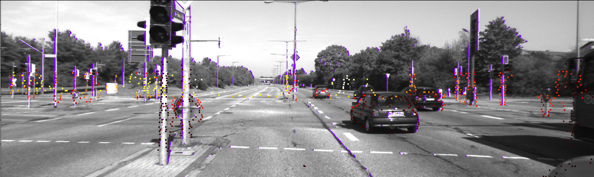
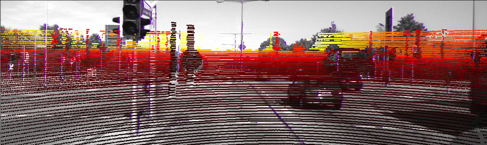
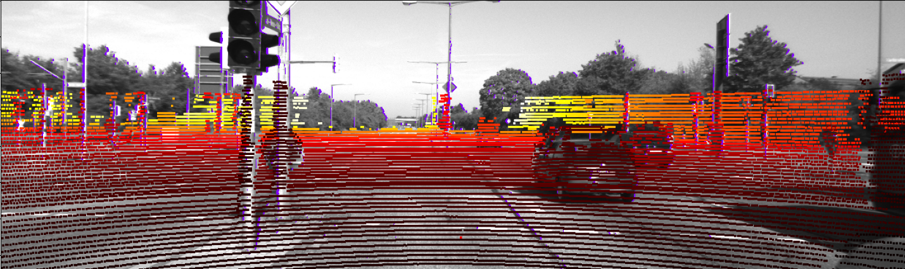

# Overview

The goal of this repository was to reproduce some of the results specified in the master thesis 
[Automatic On-Line Calibration and Calibration Monitoring of Cameras and Lidars](https://dspace.cuni.cz/bitstream/handle/20.500.11956/116608/120353341.pdf?sequence=1)
by J. Moravec. The thesis proposes an automatic calibration method based on the edge and corner detection
from images and pointclouds respectively.

Here I limited only on trying to optimize intrinsic parameters (adding extrinsics would be trivial, but I have not tried it). As an input I used recording 2011_09_26 of the Kitti dataset,
drive 18:

_Projected corners (colored) and image edges (purple) for an example frame; detection algorithms are described in [1]_

# Results
The current optimization process is done only on 150 unprocessed frames:

|                  | fx     | fy     | cx     | cy     |
|------------------|--------|--------|--------|--------|
| ground truth     | 721.54 | 721.54 | 609.56 | 172.85 |
| gradient descent | 722.55 | 718.10 | 599.05 | 144.18 |
| particle swarm   | 721.05 | 714.09 | 611.45 | 125.93 |

_Calibration parameters before the optimization_

_Calibration parameters after the optimization (gradient descent)_

# How to run
Modify the path to aforementioned Kitti dataset in the optimizer constructors. 
Run the corresponding optimization files (adagrad_optimizer.py or particle_swarm.py)

# References
[1] J. Moravec - Automatic On-Line Calibration and Calibration
Monitoring of Cameras and Lidars (master thesis)

